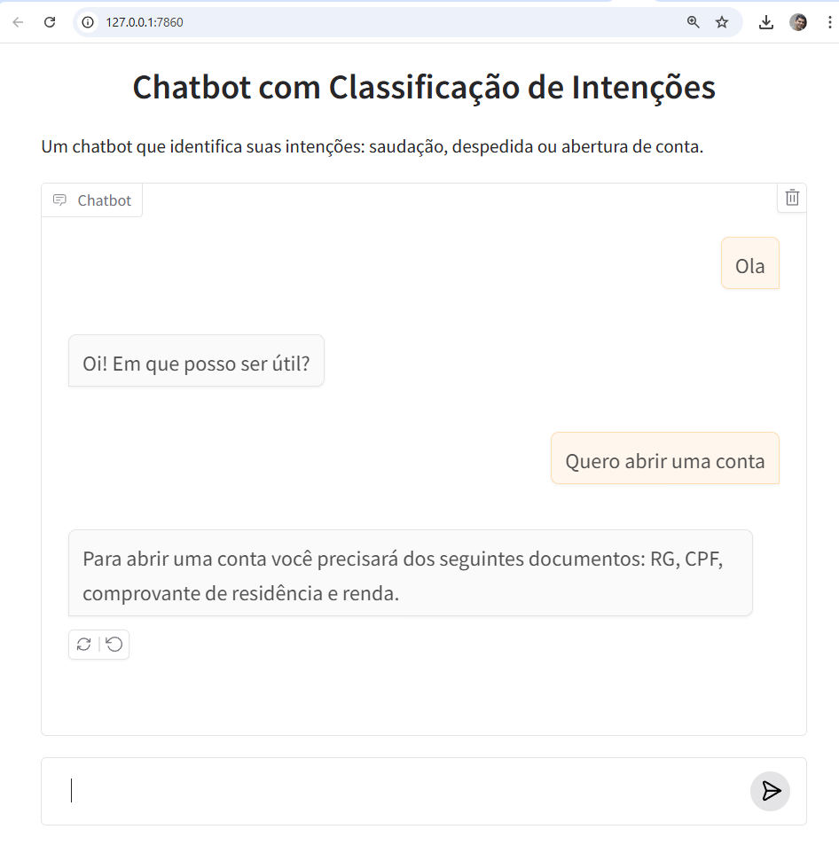

# Chatbot com Classificação de Intenções

## Descrição do Projeto
Este projeto implementa um chatbot simples que utiliza técnicas de Processamento de Linguagem Natural (PLN)
para classificar as intenções do usuário e fornecer respostas apropriadas. O chatbot identifica três tipos
de intenções: saudações, despedidas e solicitações para abrir conta.

## Estrutura do Projeto
- chatbot.py: Interface de usuário do chatbot usando Gradio
- train_intent_model.py: Script para treinar o modelo de classificação de intenções
- intent_model.pkl: Modelo treinado para classificação de intenções (gerado automaticamente)
- requirements.txt: Lista de dependências necessárias

## Como Funciona
O sistema usa um classificador Naive Bayes com vetorização de texto para identificar a intenção do usuário
com base em uma mensagem de entrada. Dependendo da intenção detectada (saudar, despedir ou abrir_conta),
o chatbot fornece uma resposta apropriada selecionada aleatoriamente de um conjunto predefinido.

## Requisitos
- Python 3.10 ou superior
- Bibliotecas Python:
  - gradio
  - scikit-learn
  - numpy
  - joblib

## Instalação
1. Instale as dependências:
   ```
   pip install -r requirements.txt
   ```

2. Execute o chatbot:
   ```
   python chatbot.py
   ```
   
Observação: Na primeira execução, se o arquivo do modelo (intent_model.pkl) não existir,
o sistema automaticamente treinará o modelo usando o script train_intent_model.py.

## Uso
Após iniciar o chatbot, uma interface web será aberta no navegador padrão.
Você pode interagir com o chatbot digitando mensagens na caixa de texto.

Exemplos de mensagens que o chatbot pode reconhecer:
- "Olá" (intenção: saudar)
- "Tchau" (intenção: despedir) 
- "Quero abrir uma conta" (intenção: abrir_conta)

## Personalização
Você pode expandir o chatbot adicionando novas intenções no arquivo train_intent_model.py
e adicionando respostas correspondentes no arquivo chatbot.py.

## Print da Tela

A imagem abaixo mostra a interface do chatbot em funcionamento:


